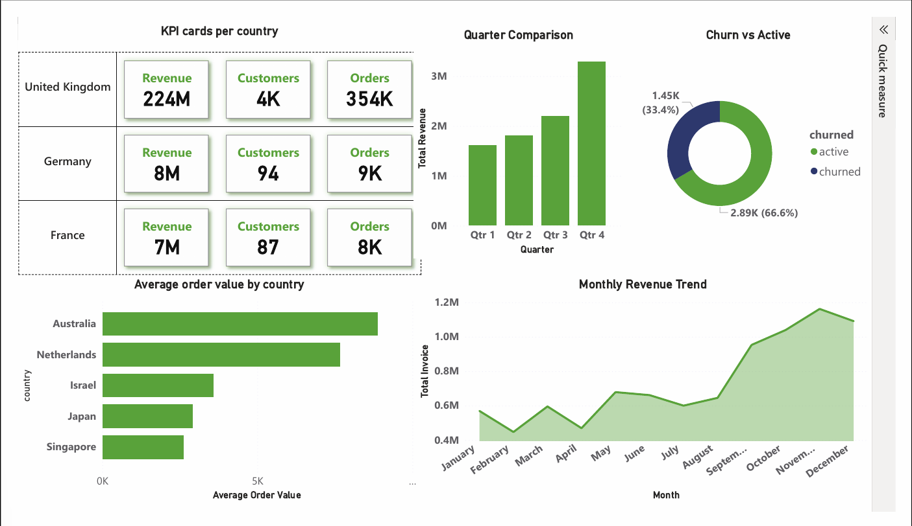
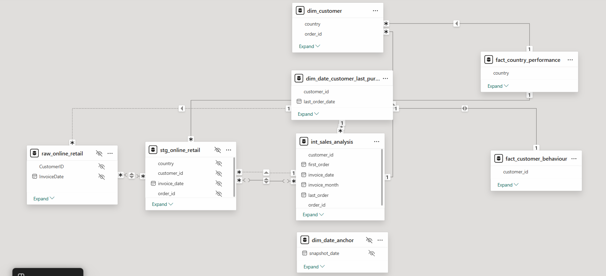
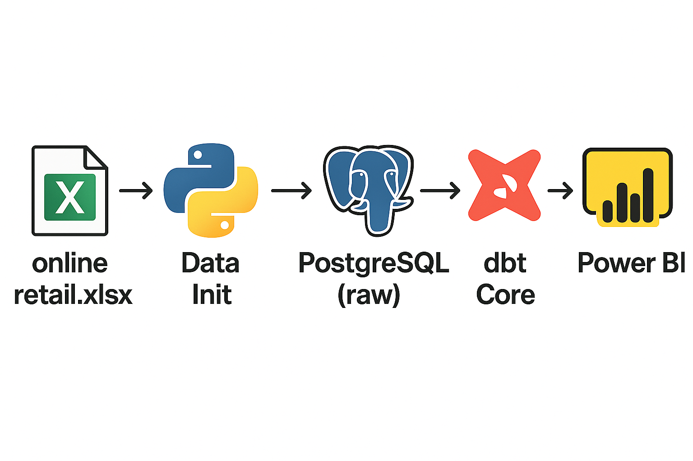

# 📊 Retail Data Pipeline: From Excel to Dashboard via DBT, PostgreSQL, and Power BI.
An **end-to-end data pipeline** designed for cleansing, modeling, and analyzing e-commerce sales data from Excel to interactive dashboards.

⏱ **Time Spent:** 2,462 minutes (~41 hours)  
🧱 **Commits:** +75 detailed commits tracking each development step

--- 

## 🗺️ Table of Contents
* [📦 Project Overview](#project-overview)
* [⚙️ Stack & Technologies](#stack--technologies)
* [🛠️ Pipeline Steps](#pipeline-steps)
* [🚀 Quick Start](#quick-start)
* [📚 What I learned](#what-i-learned)
* [🔗 Sources & References](#sources--references)
* [🚧 Future Improvements](#future-improvements)

---

## <a name="project-overview"></a>📦 Project Overview

This project implements a data pipeline to **extract data from an Excel file**, **transform and model** it through structured DBT models, and **visualize insights** using Power BI.





--- 

## <a name="stack--technologies"></a>⚙️ Stack & Technologies

**Core Tools**: Docker, DBT, PostgreSQL, Power BI\
**Programming Libraries**: `pandas`, `sqlalchemy`, `logging`\
**Project Management**: `makefile`

The primary focus was mastering **DBT**, resulting in:
* **7 structured data models**
* **15 comprehensive tests**
* Thorough metadata documentation

--- 

## <a name="pipeline-steps"></a>🛠️ Pipeline Steps



**Detailed Steps:**
1. **Extraction**: Reading data from Excel using `pandas`.
2. **Loading**: Storing raw data in PostgreSQL.
3. **Transformation & Modeling**: Using DBT to create a structured data flow:
   * Raw → Staging → Intermediate → Dimensions → Facts

4. **Visualization**: Connecting Power BI to PostgreSQL to create interactive dashboard and analyses.

---

## <a name="quick-start"></a>🚀 Quick Start

**Step 1: Clone the Repository**

```bash
git clone https://github.com/otmanedd/CleanRetailDyaf.git
cd CleanRetailDyaf
```

**Step 2: Set Up Environment Variables**
Create a `.env` file in the project root:

```bash
touch .env
```

paste this template inside `.env` file, feel free to customize it.

```env
DB_USER=dbtuser
DB_PASSWORD=dummy_password
DB_DATABASE=retail
DB_HOST=postgres
DB_PORT=5432
PGADMIN_EMAIL=bedo@email.com
PGADMIN_PASSWORD=123456
```

**Step 3: Launch Services**
Build and launch containers:

```bash
docker compose up -d --build
```

> **Tip:** Use `make up` for convenience. See `makefile` for additional dev-friendly commands.

**Step 4: Run DBT Commands**
Access DBT container:

```bash
make sh

# or directly via:
docker exec -it dbt_core bash
```

Inside the container run:

```bash
dbt run                # Run DBT models
dbt test               # Test DBT models
dbt docs generate      # Generate DBT documentation
dbt docs serve         # Serve and view documentation
```

**Step 5: Explore Data with pgAdmin**

* Visit [http://localhost:8888](http://localhost:8888)
* Use the credentials from `.env` to log in.

**Step 6: Dashboard Visualization**

* Open `dashboard/retail_analysis.pbix` in Power BI Desktop.
* Configure Power BI connection using PostgreSQL credentials from `.env`.

---

## <a name="what-i-learned"></a>📚 What I learned

* Spent alot of time in dbt documentation which deepened my knowled of **DBT's**  limitations and capabilities
* Learned custom SQL tests.
* Improved my understanding of data modeling as both a creative and technical discipline.
* Improved my skills in Docker container managment.
* Learned to integrate PostgreSQL with Power BI for analytics
* Built practical skills for creating impactful dashboards with Power BI.

---

## <a name="sources--references"></a>🔗 Sources & References

### GitHub Repositories

* [Reddit ETL Project](https://github.com/NotAbdelrahmanelsayed/reddit_etl)
* [DBT PostgreSQL Template](https://github.com/scriptstar/dbt_pg_project)

### Official Documentation

* [DBT Guides](https://docs.getdbt.com/guides)
* [DBT Data Testing](https://docs.getdbt.com/reference/data-test-configs)
* [DBT Environment Variables](https://docs.getdbt.com/reference/dbt-jinja-functions/env_var)
* [PGAdmin Docker](https://hub.docker.com/r/elestio/pgadmin)
* [Docker PostgreSQL Image](https://www.docker.com/blog/how-to-use-the-postgres-docker-official-image/)

### Courses

* [Introduction to DBT (DataCamp)](https://app.datacamp.com/learn/courses/introduction-to-dbt)
* [Introduction to Power BI (DataCamp)](https://app.datacamp.com/learn/courses/introduction-to-power-bi)

### Articles

* [Run PostgreSQL and PGAdmin using docker compose](https://medium.com/@vishal.sharma./run-postgresql-and-pgadmin-using-docker-compose-34120618bcf9)

### AI-Assisted Learning 🤖

* I spent 10 hours solving challenging dbt and SQL assignments created by ChatGPT, receiving feedback from it iteratively to sharpen my skills.

---

## <a name="future-improvements"></a>🚧 Future Improvements

* Implement **Airflow** for orchestrating the complete data pipeline (data ingestion, DBT modeling, and testing).
* Explore and utilize **DBT Cloud** for efficient deployment and monitoring.
* Deploy the PostgreSQL database to a cloud provider (AWS, Google Cloud).
